 

---

## Что делаем

- **Landing pages** — быстрые, адаптивные, с анимациями и интеграцией форм
- **Корпоративные сайты** — многостраничные, SSR/SSG, SEO-ready
- **Интернет-магазины** — каталог, корзина, платёжные интеграции, личный кабинет
- **Веб-приложения и MVP** — авторизация, REST API, работа с БД, бизнес-логика
- **Рефакторинг и редизайн** — оптимизация производительности, переход на современный стек
- **Full-stack под ключ** — от выбора архитектуры до деплоя в продакшн

---

## Стек

  

